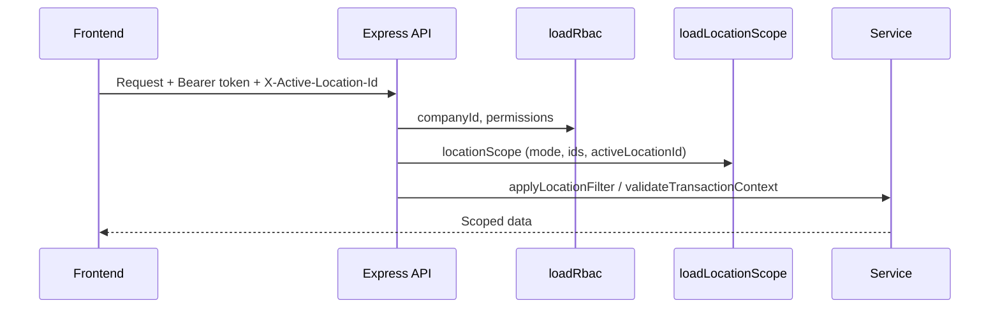
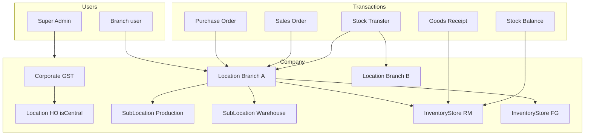

# Multi-Location ERP — Implementation & Impact

**Document version:** 2.0  
**Last updated:** 2026-05-31  
**Product:** Procurement Management System (Celeris Venture Systems Pvt. Ltd.)  
**Status:** **Implemented** — Phases 0–5 (manufacturing-ready foundation)

---

## 1. Executive summary

The Procurement Management System runs **one company** across **many operating locations**. Each location may have its **own GSTIN**, **inventory stores**, and **purchase/sales/stock** activity. Users see data only for **location(s) they are allowed to access**, with an optional **working location** in the app header.

**Location** is the permanent organizational foundation of the ERP. **Sub-locations** subdivide a plant (Production, Quality, Warehouse, etc.) without separate GST. Future modules (Production, Quality, Maintenance, MRP) should reuse the same patterns documented here.

| Capability | Status |
|------------|--------|
| Location Master + central (HO) flag | Done |
| Sub-location Master | Done |
| Inventory stores per location | Done |
| User location access + switcher | Done |
| Row-level security (RLS) | Done |
| Purchase (PO, GRN, PINV) + stock on GRN post | Done |
| Sales (SO, Delivery, SINV) + stock on delivery post | Done |
| Stock transfer + balances | Done |
| Location-based document numbering | Done |
| Location change audit trail | Done |
| Manufacturing prep (Work Center, Machine models) | Done |
| Transaction create/edit UI (full forms) | **Next iteration** |

---

## 2. Business requirements

| # | Requirement | Implementation |
|---|-------------|----------------|
| R1 | Multiple locations per company | `Location` collection |
| R2 | Optional GSTIN per location | `Location.gstin`, `usesCompanyGstin` |
| R3 | Optional inventory stores per location | `InventoryStore` linked to `locationId` |
| R4 | Purchase at central or any location | PO / GRN / PINV carry `locationId` |
| R5 | Sales at central or any location | SO / Delivery / SINV carry `locationId` |
| R6 | Users belong to one or more locations | `User.allowedLocationIds`, `defaultLocationId` |
| R7 | Users see only allowed location data | `loadLocationScope` + `applyLocationFilter` |
| R8 | Super Admin sees all locations | `locationAccessMode: "all"` or `userType: SUPER_ADMIN` |

---

## 3. Architecture

### 3.1 Tenant hierarchy

```
Company (tenant)
  └── Location (branch / plant / HO — isCentral for HO)
        ├── GSTIN (optional; fallback via usesCompanyGstin)
        ├── SubLocation (0..n zones: Production, QC, Warehouse, …)
        ├── InventoryStore (0..n)
        ├── Default stores (RM / FG / Scrap) — for future MRP
        └── Module flags (purchase, sales, production, …)
  └── User
        ├── roles → menu permissions (RBAC)
        └── locationScope → data RLS + active working location
  └── Transactions (PO, GRN, SO, …)
        ├── locationId (required)
        ├── subLocationId (optional)
        └── inventoryStoreId (required when stock moves)
```

### 3.2 Request flow



### 3.3 Design principles

1. **Company-wide masters** — Supplier, Customer, HSN/SAC, Payment Terms (location only on transactions).
2. **Location-scoped transactions & stock** — Every PO/SO/GRN/etc. has `locationId`.
3. **No breaking changes** — Legacy auto-increment rows (`locationId: null`) still work for non-location modules.
4. **Explicit governance** — `validateTransactionContext()` on all transaction creates.

---

## 4. Data model (implemented)

### 4.1 Location

**Collection:** `Location`  
**Model:** `backend/src/models/Location.model.js`

| Field | Purpose |
|-------|---------|
| `locationCode` | System code (e.g. `LOC00001`) |
| `locationId` | Business ID (e.g. `Pune Plant`, `HO`) |
| `name` | Display name |
| `isCentral` | One per company (HO) — partial unique index |
| `gstin`, `usesCompanyGstin`, `gstinEffectiveFrom` | Tax registration |
| `defaultRMStoreId`, `defaultFGStoreId`, `defaultScrapStoreId` | Future MRP / issue-receipt defaults |
| `enablePurchase`, `enableSales`, `enableProduction`, `enableQuality`, `enableMaintenance` | Feature flags (default `true`) |

### 4.2 Sub-location

**Collection:** `SubLocation`  
**Model:** `backend/src/models/SubLocation.model.js`

| Field | Purpose |
|-------|---------|
| `parentLocation` / `locationId` | Parent `Location` (both kept in sync) |
| `subLocationCode` | System code (`SLOC00001`) |
| `subLocationId` | Business code |
| `subLocationName` | Display name |
| `description`, `status`, `isActive` | Master data |
| `createdBy`, `updatedBy` | Audit |

**Index:** `{ company, locationId, subLocationCode }`  
**Use case:** Physical zones under one GSTIN (not a separate legal entity).

### 4.3 Inventory store

**Collection:** `InventoryStore`  
**Model:** `backend/src/models/InventoryStore.model.js`

| Field | Purpose |
|-------|---------|
| `locationId` | Required parent location |
| `storeCode`, `storeName` | Identity |
| `isDefault` | Default store for location |
| `status` | Active / Inactive |

### 4.4 Stock balance

**Collection:** `StockBalance`  
**Unique key:** `company + locationId + inventoryStoreId + itemId`

### 4.5 User location access

**Model:** `backend/src/models/User.model.js`

```js
defaultLocationId: ObjectId,
allowedLocationIds: [ObjectId],
locationAccessMode: "restricted" | "all"
```

### 4.6 Transactions (all implemented)

| Collection | Doc no. field | Stock impact |
|------------|---------------|--------------|
| `PurchaseOrder` | `poNo` | — |
| `GoodsReceipt` | `grnNo` | **+qty** on post |
| `PurchaseInvoice` | `invoiceNo` | — |
| `SalesOrder` | `soNo` | — |
| `DeliveryNote` | `deliveryNo` | **−qty** on post |
| `SalesInvoice` | `invoiceNo` | GST from location |
| `StockTransfer` | `transferNo` | Move between loc/store on complete |

Common fields: `company`, `locationId`, `subLocationId?`, `inventoryStoreId?`, `lines[]`, `status`.

### 4.7 Auto-increment (location-aware)

**Collection:** `AutoIncrement`  
**Model:** `backend/src/models/AutoIncrement.model.js`

| Field | Purpose |
|-------|---------|
| `module` | e.g. `PO`, `GRN`, `SO` |
| `modulePrefix` | e.g. `PUN-PO` or legacy `DGM` |
| `locationId` | `null` = company-wide; ObjectId = per-location counter |
| `autoIncrementValue`, `digit` | Counter |

**Numbering formats:**

| Scope | Example |
|-------|---------|
| Per location | `PUN-PO-000001`, `NGP-GRN-000042` |
| Company-wide (legacy) | `DGM/0032` (slash format via `formatAutoIncrementCode`) |

**Allocator:** `backend/src/utils/docNumber.js` → `allocateDocNumber(companyId, module, { locationId })`

### 4.8 Manufacturing readiness (schema only — no UI yet)

| Collection | Model path | Scoped fields |
|------------|------------|---------------|
| `WorkCenter` | `backend/src/models/WorkCenter.model.js` | `company`, `locationId`, `subLocationId` |
| `Machine` | `backend/src/models/Machine.model.js` | + `workCenterId` |

**Reusable mixin:** `backend/src/schemas/locationScopedEntity.schema.js` — spread into future schemas.

### 4.9 Location change audit

**Collection:** `LocationChangeAudit`  
**Model:** `backend/src/models/LocationChangeAudit.model.js`

Logged when `locationId` or `subLocationId` changes on PO/SO updates (extensible to other entities).

### 4.10 Master data alignment

| Master | Location fields |
|--------|-----------------|
| **Item Master** | `locationId`, `inventoryStoreId` (+ legacy `inventoryStore` string) |
| **Asset Master** | `locationId`, `subLocationId` (+ legacy `assetLocation` string) |
| **Supplier / Customer** | Company-wide |

---

## 5. Security & row-level security (RLS)

### 5.1 Middleware stack

| Order | Middleware | Output |
|-------|------------|--------|
| 1 | `requireAuth` | `req.user` |
| 2 | `loadRbac` | `req.rbac` (company, permissions) |
| 3 | `loadLocationScope` | `req.locationScope` |

**Active location header:** `X-Active-Location-Id` (also accepts `X-Location-Id`)

### 5.2 `locationScope` shape

```js
{
  mode: "all" | "restricted",
  locationIds: [ObjectId, ...],
  defaultLocationId: ObjectId,
  activeLocationId: ObjectId,
  locations: [{ _id, locationId, name, isCentral, gstin }]
}
```

**Resolver:** `backend/src/services/locationScope.service.js` → `resolveLocationScope()`

### 5.3 Helpers

| Function | File | Purpose |
|----------|------|---------|
| `applyLocationFilter` | `locationScope.js` | Add `locationId` to list queries |
| `assertLocationAccess` | `locationScope.js` | Reject forbidden location |
| `resolveBodyLocationId` | `locationScope.js` | Default from body → active → default |
| `validateTransactionContext` | `locationGovernance.js` | Mandatory `locationId`; optional store/sub-location |

### 5.4 Session payload

`GET /api/framework/session` includes:

```json
{
  "locationScope": {
    "mode": "restricted",
    "defaultLocationId": "...",
    "activeLocationId": "...",
    "locations": [...]
  }
}
```

### 5.5 UI behaviour

| User type | Behaviour |
|-----------|-----------|
| Single location | Switcher hidden if only one location |
| Multiple locations | Header dropdown — working location |
| Super Admin | All locations; optional filter via active header |

---

## 6. API reference (implemented)

### 6.1 Location & scope

| Method | Path | Notes |
|--------|------|-------|
| GET | `/api/locations` | Location Master list |
| POST/PUT/DELETE | `/api/locations` | Super Admin |
| GET | `/api/location-session/mine` | Allowed locations for user |
| PUT | `/api/location-session/active-location` | Validate selection (client stores header) |
| GET | `/api/framework/session` | Includes `locationScope` |

### 6.2 Sub-locations

| Method | Path | Notes |
|--------|------|-------|
| GET | `/api/sub-locations` | `?locationId=` or `?parentLocation=` |
| GET | `/api/sub-locations/:id` | Single record |
| GET | `/api/sub-locations/summary` | Stats |
| POST/PUT/DELETE | `/api/sub-locations` | Super Admin |

### 6.3 Inventory stores

| Method | Path | Notes |
|--------|------|-------|
| GET | `/api/inventory-stores` | `?locationId=` |
| GET | `/api/inventory-stores/by-location/:locationId` | Active stores |
| POST/PUT/DELETE | `/api/inventory-stores` | CRUD |

### 6.4 Purchase

| Method | Path | Notes |
|--------|------|-------|
| GET/POST | `/api/purchase/purchase-orders` | Location-scoped |
| GET/PUT/DELETE | `/api/purchase/purchase-orders/:id` | |
| GET/POST | `/api/purchase/goods-receipts` | Store required |
| POST | `/api/purchase/goods-receipts/:id/post` | Increases stock |
| GET/POST | `/api/purchase/purchase-invoices` | |

### 6.5 Sales

| Method | Path | Notes |
|--------|------|-------|
| GET/POST | `/api/sales/sales-orders` | |
| GET/POST | `/api/sales/delivery-notes` | Store required; post decreases stock |
| POST | `/api/sales/delivery-notes/:id/post` | |
| GET/POST | `/api/sales/sales-invoices` | `locationGstin` on invoice |

### 6.6 Stock

| Method | Path | Notes |
|--------|------|-------|
| GET | `/api/stock-transfers` | |
| POST | `/api/stock-transfers` | From/to location + store |
| POST | `/api/stock-transfers/:id/complete` | Moves qty |
| GET | `/api/stock-transfers/balances` | `?inventoryStoreId=` |

### 6.7 Audit & dashboard

| Method | Path | Notes |
|--------|------|-------|
| GET | `/api/location-audit` | `?entityType=&entityId=` |
| GET | `/api/framework/dashboard-location-stats` | `?locationId=` or active header |

---

## 7. Frontend (implemented)

### 7.1 Global shell

| Component | Path |
|-----------|------|
| Location context | `frontend/src/context/LocationScopeContext.jsx` |
| Header switcher | `frontend/src/components/layout/LocationSwitcher.jsx` |
| Active location storage | `frontend/src/utils/activeLocationStorage.js` |
| API header injection | `frontend/src/services/api.js` → `X-Active-Location-Id` |

### 7.2 Settings (Company Setup)

| Screen | Route |
|--------|-------|
| Location Master | `/app/configuration/location-master` |
| Sub-locations | `/app/configuration/sub-locations` |
| Inventory Stores | `/app/configuration/inventory-stores` |
| User Management | Location access on user form |

### 7.3 Transactions (list views)

| Screen | Route |
|--------|-------|
| Purchase Orders | `/app/purchase/purchase-order` |
| Goods Receipts | `/app/purchase/goods-receipt` or `/app/stores/grn` |
| Sales Orders | `/app/sales/sales-order` |
| Stock Transfer | `/app/stores/goods-transfer` |

### 7.4 Dashboard

**Component:** `frontend/src/components/dashboard/LocationDashboardStats.jsx`  
Shows current location plus PO / GRN / SO / Delivery counts and stock totals when the working location changes.

---

## 8. GST rules

| Scenario | Rule |
|----------|------|
| Location has GSTIN | Use on sales invoice (`locationGstin`) |
| `usesCompanyGstin: true` | Effective GSTIN resolved via `getEffectiveGstin()` |
| Inter-state | Standard party vs location GSTIN logic (future tax engine) |
| Uniqueness | Sparse unique index `{ company, gstin }` where gstin non-empty |

---

## 9. Document numbering

### 9.1 Configuration

1. Per-location counters are created by seed or on first document save (`allocateDocNumber` upserts).
2. **Settings → Auto Increment** still supports company-wide modules (`locationId` null).
3. For a new location, run `npm run seed:location-doc-auto-increment` or let first PO/GRN create rows.

### 9.2 Modules seeded per location

`PO`, `GRN`, `SO`, `DN`, `PINV`, `SINV`, `ST`

---

## 10. Implementation phases (status)

| Phase | Scope | Status |
|-------|--------|--------|
| **0 — Foundation** | Location, stores, user access, middleware, switcher | **Done** |
| **1 — Master alignment** | Item/Asset `locationId`, store refs, list filters | **Done** |
| **2 — Purchase** | PO, GRN, PINV APIs + GRN stock post | **Done** (list UI; upsert forms pending) |
| **3 — Sales** | SO, Delivery, SINV + delivery stock post | **Done** (list UI; upsert forms pending) |
| **4 — Advanced** | Stock transfer, balances | **Done** |
| **5 — Manufacturing prep** | Sub-location enhance, loc numbering, audit, governance, dashboard, WC/Machine schemas | **Done** |
| **Next** | Full transaction forms, GSTR reports, Production module | Planned |

---

## 11. Migration & seeds

Run from `backend/` directory:

```bash
# Full multi-location bootstrap (new environments)
npm run seed:multi-location

# Individual scripts
npm run seed:location-central              # HO / central location per company
npm run seed:inventory-stores-from-master-data  # Master Data → InventoryStore + Item links
npm run seed:user-location-access          # Default allowedLocationIds for users
npm run seed:inventory-stores-menu         # Settings menu card

# Phase 5 — per-location document counters
npm run seed:location-doc-auto-increment
# or
npm run seed:phase5
```

### 11.1 Backward compatibility

- Missing `locationId` on create → defaults via `resolveBodyLocationId` (active → default).
- `ItemMaster.inventoryStore` string retained; `inventoryStoreId` preferred.
- Company-wide auto-increment (`locationId: null`) unchanged for supplier/item codes.

---

## 12. Operations runbook

### 12.1 New branch / plant

1. **Location Master** — Create location; set `isCentral` only for HO.
2. **Inventory Stores** — Add RM/FG stores; set defaults on Location when UI fields are exposed.
3. **Sub-locations** — Add zones (Production, Warehouse, etc.) if needed.
4. Run `npm run seed:location-doc-auto-increment` for that company (or all companies).
5. **User Management** — Assign `allowedLocationIds` and `defaultLocationId`.

### 12.2 New user

1. Assign roles (RBAC).
2. Set **Default location** and **Allowed locations** (or `locationAccessMode: all` for HO admins).
3. User selects working location in header; all API calls scope to that location when restricted.

### 12.3 Troubleshooting

| Symptom | Check |
|---------|--------|
| Empty PO/SO lists | User `allowedLocationIds`; active header; `applyLocationFilter` |
| Wrong document number format | `AutoIncrement` row for `locationId`; re-run location doc seed |
| GRN post fails | Store required; stock exists for negative check on transfers |
| Cannot access location | `assertLocationAccess` — add location to user |

---

## 13. Risk register

| Risk | Mitigation |
|------|------------|
| Missing location filter on new API | Use `applyLocationFilter` + `validateTransactionContext`; code review checklist |
| Duplicate GSTIN | Sparse unique `{ company, gstin }` |
| Empty lists for branch user | Default location on user; central location seed |
| Sub-location vs Location confusion | UI label “Sub-location”; transactions scoped to Location |
| Dual numbering (legacy vs location) | Clear `locationId` on AutoIncrement rows; document in training |

---

## 14. Testing checklist

| Area | Test |
|------|------|
| RLS | User with Loc A only cannot read Loc B PO |
| Numbering | PO from Pune → `PUN-PO-000001`; from Nagpur → `NGP-PO-000001` |
| GRN stock | Post GRN increases `StockBalance` at store |
| Delivery | Post delivery decreases stock |
| Transfer | Complete transfer moves qty from → to |
| Super Admin | Sees all locations; header filter works |
| Audit | Change PO `locationId` → row in `LocationChangeAudit` |
| Mobile | Location switcher readable on small screens |

---

## 15. Decision log

| Question | Decision |
|----------|----------|
| Suppliers/customers per location? | **Company-wide** |
| Sub-location for MVP? | **Yes** — zones under Location; not separate GST |
| Stores per location? | **Many**; one `isDefault` |
| User all-locations access? | **Super Admin / `locationAccessMode: all` only** |
| Active location transport | **Header** `X-Active-Location-Id` |
| Document number format (location) | `{LOC}-{MODULE}-{000000}` hyphenated |
| Legacy document format | `{PREFIX}/{0000}` slash (company-wide) |

---

## 16. Architecture diagram



---

## 17. Code reference index

### 17.1 Backend — core

| Topic | Path |
|-------|------|
| Location model | `backend/src/models/Location.model.js` |
| SubLocation model | `backend/src/models/SubLocation.model.js` |
| InventoryStore | `backend/src/models/InventoryStore.model.js` |
| StockBalance | `backend/src/models/StockBalance.model.js` |
| User location fields | `backend/src/models/User.model.js` |
| Location scope utils | `backend/src/utils/locationScope.js` |
| Location governance | `backend/src/utils/locationGovernance.js` |
| Document numbering | `backend/src/utils/docNumber.js` |
| Location scope service | `backend/src/services/locationScope.service.js` |
| Location audit | `backend/src/services/locationAudit.service.js` |
| Stock service | `backend/src/services/stock.service.js` |
| Scoped entity mixin | `backend/src/schemas/locationScopedEntity.schema.js` |

### 17.2 Backend — transactions

| Topic | Path |
|-------|------|
| Purchase service | `backend/src/services/purchaseTransaction.service.js` |
| Sales service | `backend/src/services/salesTransaction.service.js` |
| Stock transfer | `backend/src/services/stockTransfer.service.js` |
| Transaction helpers | `backend/src/services/transactionBase.service.js` |

### 17.3 Backend — middleware & routes

| Topic | Path |
|-------|------|
| loadLocationScope | `backend/src/middleware/loadLocationScope.js` |
| Route mount | `backend/src/routes/index.js` |
| Location session | `backend/src/routes/locationSession.routes.js` |
| Inventory stores | `backend/src/routes/inventoryStore.routes.js` |
| Purchase / Sales / Stock | `backend/src/routes/purchaseTransaction.routes.js`, `salesTransaction.routes.js`, `stockTransfer.routes.js` |
| Location audit | `backend/src/routes/locationAudit.routes.js` |

### 17.4 Frontend

| Topic | Path |
|-------|------|
| LocationScopeContext | `frontend/src/context/LocationScopeContext.jsx` |
| LocationSwitcher | `frontend/src/components/layout/LocationSwitcher.jsx` |
| Dashboard stats | `frontend/src/components/dashboard/LocationDashboardStats.jsx` |
| API client | `frontend/src/services/api.js` |

### 17.5 Seeds

| Script | `package.json` command |
|--------|-------------------------|
| Central location | `seed:location-central` |
| Stores from master data | `seed:inventory-stores-from-master-data` |
| User access | `seed:user-location-access` |
| All Phase 0–4 seeds | `seed:multi-location` |
| Location doc counters | `seed:location-doc-auto-increment` / `seed:phase5` |

### 17.6 Related docs

| Topic | Path |
|-------|------|
| Technical guide — locations | `docs/TECHNICAL_GUIDE.md` §7.5 |
| Masters pattern | `docs/MASTERS_MODULE_IMPLEMENTATION.md` |

---

## 18. Remaining work (product backlog)

| Item | Priority | Notes |
|------|----------|-------|
| PO / GRN / SO **create-edit forms** | High | APIs complete; list + post/delete only |
| Location Master UI for default stores & feature flags | Medium | Schema + payload ready |
| Location audit panel on transaction detail | Medium | API: `GET /api/location-audit` |
| Auto Increment UI — `locationId` column | Medium | Backend supports field |
| Production / Quality / Maintenance modules | Future | Use `locationScopedEntity` mixin |
| GSTR / branch P&L reports | Future | Filter by `locationId` + GSTIN |
| Role permission `viewAllLocations` | Low | Today: user assignment + Super Admin |

---

## 19. Document history

| Version | Date | Changes |
|---------|------|---------|
| 1.0 | 2026-05-31 | Initial architecture proposal |
| 2.0 | 2026-05-31 | Full update: Phases 0–5 implemented; API/UI reference; runbook; backlog |

---

*This document is the authoritative guide for multi-location behaviour in the Procurement Management System. Update version 2.x when transaction forms or additional modules ship.*
