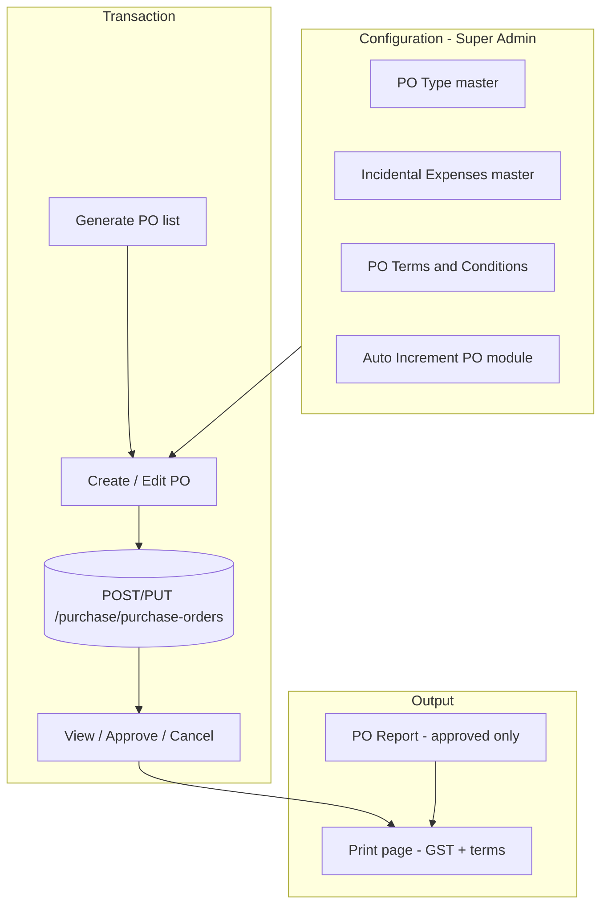

# Purchase Order — Transaction to Report Implementation Reference

> **Purpose:** Document how the Purchase Order (PO) module was built end-to-end in the Procurement Management System (Celeris) — from configuration and auto-increment through screens, validation, print/PDF, and reporting. Use this as the **blueprint** when implementing other purchase transactions (GRN, Purchase Invoice, Debit Note, etc.) and similar report modules.
>
> **Last updated:** June 2026  
> **Related docs:** `TECHNICAL_GUIDE.md`, `MULTI_LOCATION_IMPLEMENTATION_AND_IMPACT.md`, `MASTERS_MODULE_IMPLEMENTATION.md`

---

## Table of Contents

1. [Overview](#1-overview)
2. [End-to-end flow](#2-end-to-end-flow)
3. [Menu, navigation & RBAC](#3-menu-navigation--rbac)
4. [Configuration & master data](#4-configuration--master-data)
5. [Document numbering (auto-increment)](#5-document-numbering-auto-increment)
6. [Dropdowns & field data sources](#6-dropdowns--field-data-sources)
7. [Backend implementation](#7-backend-implementation)
8. [Frontend screens](#8-frontend-screens)
9. [Form state & API payload](#9-form-state--api-payload)
10. [Validation rules](#10-validation-rules)
11. [GST calculation](#11-gst-calculation)
12. [PO terms snapshot (print page 2)](#12-po-terms-snapshot-print-page-2)
13. [Print & PDF](#13-print--pdf)
14. [Purchase Order report](#14-purchase-order-report)
15. [Multi-location](#15-multi-location)
16. [Auth bridge for new tabs](#16-auth-bridge-for-new-tabs)
17. [Checklist: implement another transaction](#17-checklist-implement-another-transaction)
18. [File index](#18-file-index)
19. [Deploy & seed steps](#19-deploy--seed-steps)

---

## 1. Overview

The PO module covers:

| Layer | What was built |
|-------|----------------|
| **Configuration** | PO Type, Incidental Expenses, PO Terms & Conditions (company-level) |
| **Transaction** | Generate PO — create, edit (draft), view, approve, cancel, delete |
| **Fulfillment hook** | Line `receivedQty` / `grnStatus` updated when GRN is posted (shared service) |
| **Print** | Standalone A4 print/PDF with GST breakdown and optional terms page 2 |
| **Report** | Approved PO register with filters, pagination, totals, open print in new tab |

**Design principles used:**

- **Location-scoped** documents and numbering (`X-Active-Location-Id`).
- **Client + server validation** with the same business rules where possible.
- **Shared purchase router/service** for PO, GRN, PI (extend, don’t duplicate).
- **Menu catalog drives UI** — routes, hub cards, and `PermissionGuard` `menuCode` must match.
- **GST on print only** (removed from create/edit UI; still calculated and stored on save).
- **Terms HTML snapshotted** on PO at create/update so historical prints stay consistent.

---

## 2. End-to-end flow



**Status workflow (PO):**

| Status | Meaning |
|--------|---------|
| `Draft` | Editable; appears in Generate PO list |
| `Approved` | Locked; appears in PO report |
| `Partially Received` / `Closed` | Derived from GRN line progress |
| `Cancelled` | Draft cancelled |

**List vs report filters (important):**

| API | Excludes | UI |
|-----|----------|-----|
| `GET /purchase/purchase-orders` | `Approved`, `Cancelled` | Generate PO workbench (drafts in progress) |
| `GET /purchase/reports/purchase-orders` | `Draft`, `Cancelled` | Approved register |

---

## 3. Menu, navigation & RBAC

### 3.1 Catalog source

All sidebar and hub cards are defined in:

`backend/scripts/menu-catalog.js`

After catalog changes, sync menus:

```bash
cd backend
node scripts/seed-erp-sidebar.js
```

### 3.2 Purchase navigation hierarchy

```
Purchase (purchase)
└── Purchase Order (purchase/purchase-order)
    ├── Generate PO          → implemented
    ├── Amend PO             → placeholder
    ├── Cancel PO            → placeholder
    ├── Short PO Closing     → placeholder
    └── Repeat PO            → placeholder

Reports (reports)
└── Purchase (reports/purchase) — 20 report cards
    └── Purchase Order (reports/purchase/purchase-order) → implemented
```

### 3.3 Menu codes (must match `App.jsx` `PermissionGuard`)

| Feature | `menuCode` | Route segment |
|---------|------------|---------------|
| Purchase hub | `purchase` | `purchase` |
| PO hub | `purchase_purchase_order` | `purchase/purchase-order` |
| Generate PO | `purchase_purchase_order_generate_po` | `purchase/purchase-order/generate-po` |
| Reports → Purchase hub | `reports_purchase` | `reports/purchase` |
| PO report | `reports_purchase_purchase_order` | `reports/purchase/purchase-order` |
| PO Type config | `po_type` | `configuration/po-type` |
| Incidental expenses config | `incidental_expenses` | `configuration/incidental-expenses` |
| PO Terms config | `po_terms_and_conditions` | `configuration/po-terms-and-conditions` |

### 3.4 Frontend routes (`frontend/src/App.jsx`)

**Route order matters** — more specific paths before `:id`:

1. `generate-po` (list)
2. `generate-po/new` (create)
3. `generate-po/:id/edit` (edit)
4. `generate-po/:id/print` (print)
5. `generate-po/:id` (detail — supports `?intent=view|approve|cancel|preview`)

Report route:

- `reports/purchase` → `HubLandingPage`
- `reports/purchase/purchase-order` → `PurchaseOrderReportPage`
- `reports/purchase/:reportSlug` → placeholder for other reports

### 3.5 Hub landing behaviour

`frontend/src/components/hub/HubLandingPage.jsx`:

- Loads child cards via framework landing API (`parentCode`).
- **Special case:** card segment `reports/purchase/purchase-order` opens in a **new tab** via `openAuthenticatedAppTab()` (not in-app navigate).

---

## 4. Configuration & master data

### 4.1 Data Management cards (super admin)

Defined in `menu-catalog.js` under `data_mgmt_group`:

| Screen | Route | Model / storage |
|--------|-------|-----------------|
| **PO Type** | `/app/configuration/po-type` | Master Data category `"PO Type"` |
| **Incidental Expenses** | `/app/configuration/incidental-expenses` | Master Data category `"Incidental Expenses"` |
| **PO Terms & Conditions** | `/app/configuration/po-terms-and-conditions` | `PoTermsConfig` collection (per company) |

**Pages:**

- `frontend/src/pages/settings/PoTypeMasterPage.jsx`
- `frontend/src/pages/settings/IncidentalExpensesMasterPage.jsx`
- `frontend/src/pages/settings/PoTermsAndConditionsPage.jsx`

### 4.2 PO Terms document (`PoTermsConfig`)

| Field | Usage |
|-------|--------|
| `openingLineHtml` | Rich text — page 1 intro on print (below header) |
| `termsBodyHtml` | Rich text — **page 2** on print (full T&C) |

**API:**

- `GET /api/purchase/po-terms-config`
- `PUT /api/purchase/po-terms-config`

**Snapshot on PO:** On create/update, `openingLineHtml` and `termsBodyHtml` are copied from company config into `po.poTerms` if not already present on the document (`mergePoTermsWithSnapshot` in `poTermsConfig.service.js`). Operational terms (ship-to, freight, payment, etc.) come from the form.

### 4.3 Transactional masters (used on PO form)

| Master | Used for |
|--------|----------|
| Supplier | Header supplier, linked items |
| Item (via supplier link) | PO lines |
| Location | Active location, ship-to lookup |
| Payment Terms | PO Terms → payment dropdown |
| Logistics (LSP) | PO Terms → transporter dropdown |
| HSN / GST on item | Line tax rates |

### 4.4 Fallback constants

If master data is not seeded, the UI uses fallbacks in `frontend/src/config/purchaseOrderFormOptions.js`:

- `FALLBACK_PO_TYPE_OPTIONS` — Standard / Planned / Blanket PO
- `FALLBACK_INCIDENTAL_EXPENSE_ROWS` — Freight, Loading, Packing, Insurance
- `TRANSPORT_MODE_OPTIONS`, `FREIGHT_TERMS_OPTIONS` — static enums

---

## 5. Document numbering (auto-increment)

### 5.1 PO module keys

| Constant | Value |
|----------|--------|
| `moduleKey` | `"PO"` |
| `modulePrefix` | `"PO"` |
| Digits | `6` (via `transactionBase.nextDocNo`) |

GRN uses `"GRN"` / `"GRN"`; Purchase Invoice uses `"PINV"` / `"PINV"` — same pattern.

### 5.2 Number format

Allocated via `allocateDocNumber` → `formatAutoIncrementCode`:

```
{PREFIX}/{NNNNNN}
```

Example: `PO/000001` (prefix and padding come from `AutoIncrement` document for company + location).

Numbers are **location-scoped** when `locationId` is passed; falls back to company-central `locationId: null` row if no location row exists.

### 5.3 Create flow (avoid duplicate numbers on failure)

1. Insert PO with provisional number: `TMP-PO-{timestamp}-{random}`.
2. Call `nextDocNo(companyId, "PO", "PO", locationId)`.
3. Assign real `poNo` and save.
4. On numbering failure, delete provisional document.

### 5.4 Preview (no increment)

- **API:** `GET /api/purchase/purchase-orders/preview-number`
- **Frontend:** `previewPurchaseOrderNoRequest()` on create screen load (not in edit mode).
- **Validation:** Client requires `form.poNo` from preview before save.

### 5.5 Setup requirement

Ensure **Settings → Auto Increment** has a `PO` module for the company (and per location if using location allocation). Without it, preview/save shows “PO number is not available”.

---

## 6. Dropdowns & field data sources

| UI field | Source |
|----------|--------|
| PO Type | `useMasterDataOptions(MASTER_DATA_CATEGORY.PO_TYPE)` → fallback `FALLBACK_PO_TYPE_OPTIONS` |
| Incidental expense rows | `useIncidentalExpenseTemplates()` → Master Data `"Incidental Expenses"` → fallback rows |
| Supplier | `PoSupplierLookupModal` → `listSupplierMasterRequest` |
| Lines | `listSupplierLinkedItemsRequest(supplierId)` on supplier change |
| Ship-To | `PoShipToLocationLookupModal` → locations; defaults from active location |
| Mode of transport | `TRANSPORT_MODE_OPTIONS` (static) |
| Freight terms | `FREIGHT_TERMS_OPTIONS` (static) |
| Payment terms | `listPaymentTermsMasterRequest` → mapped to select options |
| Transporter | `listLogisticsMasterRequest` → active LSP names |
| PO Type = Blanket PO | EDD not required (validation flag `isBlanketPo`) |

**Hooks:** `frontend/src/hooks/useMasterDataOptions.js`  
**Categories:** `frontend/src/config/masterDataCategories.js`

---

## 7. Backend implementation

### 7.1 Route mount

`backend/src/routes/index.js` → `router.use("/purchase", purchaseTransactionRoutes)`

**File:** `backend/src/routes/purchaseTransaction.routes.js`

**Middleware (all routes):** `requireAuth` → `loadRbac` → `loadLocationScope`

### 7.2 API endpoints

| Method | Path | Handler |
|--------|------|---------|
| GET | `/po-terms-config` | Company PO terms HTML |
| PUT | `/po-terms-config` | Save PO terms |
| GET | `/purchase-orders/preview-number` | Next PO number preview |
| GET | `/reports/purchase-orders` | Paginated PO report |
| GET | `/purchase-orders` | Draft workbench list |
| GET | `/purchase-orders/:id` | Single PO (enriched terms if missing) |
| POST | `/purchase-orders` | Create |
| PUT | `/purchase-orders/:id` | Update (draft only) |
| DELETE | `/purchase-orders/:id` | Delete (draft only) |
| POST | `/purchase-orders/:id/approve` | Approve |
| POST | `/purchase-orders/:id/cancel` | Cancel draft |

### 7.3 Controller pattern

`backend/src/controllers/purchaseTransaction.controller.js`

```javascript
function ctx(req) {
  return { companyId: req.user.companyId, scope: req.locationScope, userId: req.user._id };
}
// Responds: { success: true, data }
```

### 7.4 Service highlights

**File:** `backend/src/services/purchaseTransaction.service.js`

| Function | Notes |
|----------|--------|
| `createPurchaseOrder` | Validate → GST → snapshot terms → provisional doc → `nextDocNo` |
| `updatePurchaseOrder` | Draft only; supplier immutable; merge terms snapshot; GST recalc on lines |
| `getPurchaseOrder` | `mergePoTermsWithSnapshot` for legacy POs missing HTML terms |
| `approvePurchaseOrder` | `Draft` → `Approved` |
| `listPurchaseOrderReport` | Pagination, date/supplier/search filters, aggregate totals |
| `applyGrnToPurchaseOrder` | GRN integration — line receipt quantities |

**Shared base:** `backend/src/services/transactionBase.service.js`

- `scopedListFilter`, `resolveTxnContext`, `nextDocNo`, `previewDocNo`, `normalizeLines`, `sumLines`

### 7.5 Document model

**File:** `backend/src/models/PurchaseOrder.model.js`  
**Collection:** `PurchaseOrder`

Key fields:

```javascript
{
  company, locationId, subLocationId, inventoryStoreId,
  poNo, poDate, supplierId, supplierName,
  poType, currency, orderReferenceNo, orderReferenceDate,
  incidentalExpenses: [{ description, amount }],
  poValue: { /* GST rollup — Mixed */ },
  poTerms: { /* ship-to, freight, payment, openingLineHtml, termsBodyHtml — Mixed */ },
  status, grnStatus,
  lines: [ transactionLineSchema ],
  totalAmount, remarks, createdBy, updatedBy
}
```

**Line schema:** `backend/src/models/schemas/transactionLine.schema.js` — qty, rate, fulfillment fields, HSN/GST split fields, `edd`, `eqt`, `tag`.

**Indexes:** `{ company, poNo }` unique; `{ company, locationId, poDate }`.

### 7.6 Server-side validation (`validatePurchaseOrderCreate`)

- `supplierId`, `poType`, `poDate` required
- Ship-to: `poTerms.shipToLocation` or `poTerms.shipToLocationId`
- At least one line with `qty > 0`
- Per line: `qty > 0`, `rate > 0`
- **EDD required** unless `poType` is `"blanket po"` (case-insensitive)
- Location from `resolveTxnContext(body, scope)`

**Update rules:** draft only; cannot change supplier; `validatePoLineFulfillment` when lines change.

---

## 8. Frontend screens

| Screen | Component | Path |
|--------|-----------|------|
| PO action hub | `HubLandingPage` | `/app/purchase/purchase-order` |
| List | `PurchaseOrderListPage.jsx` | `.../generate-po` |
| Create / Edit | `PurchaseOrderCreatePage.jsx` | `.../new`, `.../:id/edit` |
| Detail | `PurchaseOrderDetailPage.jsx` | `.../:id?intent=...` |
| Print | `PurchaseOrderPrintPage.jsx` | `.../:id/print` |
| Report | `PurchaseOrderReportPage.jsx` | `/app/reports/purchase/purchase-order` |

### 8.1 Create / edit page behaviours

- Loads **preview PO number** on create only.
- **Supplier change** → reload linked items → merge with existing lines in edit mode.
- **Preview document** button required before first save (`hasClickedPreview`).
- Modals: supplier, ship-to, incidental expenses, PO value/terms, EDD schedules, EQT, tags, order reference.
- **GST:** computed client-side via `computePoValue` / `computePurchaseOrderGst`; not shown on form (print only).
- Save: `purchaseOrderFormToPayload` → `createPurchaseOrderRequest` / `updatePurchaseOrderRequest`.
- Edit: `getPurchaseOrderRequest` → `purchaseOrderDocToForm`.

### 8.2 Detail page intents

Query `intent`:

| Intent | Actions |
|--------|---------|
| `view` | Read-only |
| `approve` | Approve draft |
| `cancel` | Cancel draft |
| `preview` | In-shell document preview + browser print |

Dedicated print route is preferred for PDF layout (standalone, no sidebar).

### 8.3 Reusable purchase components

`frontend/src/components/purchase/`:

- `PoValueTermsModal`, `PoIncidentalExpensesModal`, `PoExpectedDeliveryDateModal`
- `PoSupplierLookupModal`, `PoShipToLocationLookupModal`, `PoItemLookupModal`
- `PoDocumentPreview`, `PoGstSummary` (preview path only)

---

## 9. Form state & API payload

**File:** `frontend/src/utils/purchaseOrderFormState.js`

| Function | Role |
|----------|------|
| `emptyPurchaseOrderForm` | Initial state + incidental rows |
| `purchaseOrderDocToForm` | API → form (operational `poTerms` only; not HTML fields) |
| `purchaseOrderFormToPayload` | Form → API body + `locationId` + GST-enriched lines |
| `computePoValue` / `computePoGstBundle` | Client GST preview |
| `mergeSupplierLinesWithExisting` | Preserve line keys/fulfillment on edit |
| `serializeEddForPayload` / `serializeEqtForPayload` | JSON in line `edd` / `eqt` |

**Payload shape (simplified):**

```javascript
{
  locationId,           // from active location header
  poDate, supplierId, poType, currency,
  orderReferenceNo, orderReferenceDate,
  lines: [{ lineNo, itemId, qty, rate, hsnCode, gstRate, edd, eqt, taxableAmount, igst*, cgst*, sgst*, ... }],
  incidentalExpenses: [{ description, amount }],
  poValue: { supplyType, totals, gstSummary, ... },
  poTerms: { shipToLocation, shipToLocationId, freightTerms, paymentTerms, ... },
  status, remarks
}
```

**Note:** `openingLineHtml` / `termsBodyHtml` are **not** sent from the form; backend snapshots them from `PoTermsConfig`.

**API client:** `frontend/src/services/api.js` — all under `/purchase/...` with `X-Active-Location-Id` header via `apiFetch`.

---

## 10. Validation rules

### 10.1 Client (`purchaseOrderValidation.js`)

| Rule | Error |
|------|--------|
| `poNo` present | From preview / auto-increment |
| `supplierId` | Required |
| `poType` | Required |
| `poDate` | Required, valid date |
| `activeLocationId` | Required (header location) |
| Ship-to | `shipToLocation` or `shipToLocationId` |
| Lines | Supplier has linked items; at least one line with qty > 0 |
| Per line (qty > 0) | `qty > 0`, `rate > 0` |
| EDD | Required unless Blanket PO |
| Excluded lines | `qty` blank or `0` — skipped (`isLineExcludedFromPo`) |

### 10.2 Server

Mirrors client rules in `validatePurchaseOrderCreate` inside `purchaseTransaction.service.js`.

### 10.3 UX guard

Create page: user must click **Preview** before Save is allowed (validates layout and loads preview state).

---

## 11. GST calculation

**Shared logic (keep in sync):**

- `backend/src/utils/poGstCalculation.js`
- `frontend/src/utils/poGstCalculation.js`

| Concept | Behaviour |
|---------|-----------|
| Supply type | Intra-state → CGST + SGST; inter-state → IGST |
| Line tax | From item `gstRate` + taxable amount |
| Incidental | Taxed at max line GST rate; HSN bucket `"OTH Charges"` |
| Stored `poValue` | `supplyType`, GSTINs, states, taxable/tax totals, `gstSummary[]`, `totalPoValue` |

**Buyer GSTIN:** Resolved from ship-to location (`poTerms.shipToLocationId`) or PO `locationId` via `getEffectiveGstin`.

**UI policy:** GST summary removed from create/edit/view screens; shown on **print/PDF** only.

---

## 12. PO terms snapshot (print page 2)

| Section on print | Field | Page |
|------------------|-------|------|
| Intro bullets / greeting | `poTerms.openingLineHtml` | Page 1 |
| Freight, payment, transport (PO TERMS block) | Operational `poTerms` fields | Page 1 |
| Full terms & conditions | `poTerms.termsBodyHtml` | **Page 2** (`page-break-before: always`) |

**Why a PO might miss page 2:**

- PO created before terms were saved in Data Management.
- `termsBodyHtml` was empty in config at create time.

**Fix behaviour (implemented):**

- `getPurchaseOrder` and draft `updatePurchaseOrder` call `mergePoTermsWithSnapshot` — backfill missing HTML from current company config without overwriting existing snapshots.

**For new POs:** Save PO Terms (both editors) in configuration **before** creating the PO.

---

## 13. Print & PDF

### 13.1 Standalone layout

`AppShellLayout.jsx` treats these as **standalone** (no ERP sidebar):

- `/app/reports/purchase/purchase-order`
- `/app/purchase/purchase-order/generate-po/:id/print`

CSS class: `erp-standalone-report`.

### 13.2 Print page

**Files:**

- `frontend/src/pages/purchase/PurchaseOrderPrintPage.jsx`
- `frontend/src/pages/purchase/PurchaseOrderPrintPage.module.css`
- `frontend/src/utils/poPrintHelpers.js`

**Behaviours:**

- Loads PO, company, supplier, ship-to location.
- `document.body.classList.add("po-print-active")` for print CSS.
- Draft watermark when `status === "Draft"`.
- Max **5 line rows** on page 1 (`PO_PRINT_MAX_LINE_ROWS`); padding rows if fewer.
- GST table from `poValue.gstSummary`.
- Amount in words via `inrAmountInWords.js`.
- User triggers `window.print()` → browser PDF.
- Page 2 when `hasRichTextContent(poTerms.termsBodyHtml)`.

### 13.3 Opening print from report

`PurchaseOrderReportPage` → PDF icon → `openAuthenticatedAppTab(appPath('purchase/purchase-order/generate-po/{id}/print'))`.

---

## 14. Purchase Order report

**Page:** `frontend/src/pages/reports/PurchaseOrderReportPage.jsx`

| Feature | Implementation |
|---------|----------------|
| Default dates | Current calendar month |
| Filters | Supplier, from/to date, search (PO no / supplier) |
| Apply / Reset | `applied` state; resets page to 1 |
| Pagination | 25 per page; `ErpMasterListFooter` |
| Totals row | API `totals.totalTaxable`, `totalGst`, `totalPoValue` |
| Status filter | Backend excludes `Draft`, `Cancelled` |
| Location | Re-fetch when `activeLocation` changes |
| PDF action | New tab → print route |

**API:** `GET /api/purchase/reports/purchase-orders?page&pageSize&fromDate&toDate&supplierId&search`

**Display status mapping:** e.g. Approved + partial GRN → `"GRN Partial Created"` (`mapPoReportRow` in service).

---

## 15. Multi-location

| Layer | Mechanism |
|-------|-----------|
| Frontend header | User selects active location → `getActiveLocationId()` |
| API | `X-Active-Location-Id` on every `apiFetch` |
| Backend | `loadLocationScope` → `req.locationScope` |
| Queries | `scopedListFilter(companyId, scope)` → filters by active/allowed locations |
| Create payload | `locationId` from active location in `purchaseOrderFormToPayload` |
| Doc numbers | Per-`locationId` in `AutoIncrement` |
| Audit | `auditLocationOnUpdate` when PO location fields change |

See `MULTI_LOCATION_IMPLEMENTATION_AND_IMPACT.md` for full governance rules.

---

## 16. Auth bridge for new tabs

`sessionStorage` is **not** shared across tabs. For report and print in new tabs:

**File:** `frontend/src/utils/authStorage.js`

| Function | When |
|----------|------|
| `publishAuthForNewTab()` | Copies auth to `localStorage` bridge key |
| `openAuthenticatedAppTab(path)` | Bridge + `window.open` |
| `consumeAuthTabBridge()` | `ProtectedRoute` on load restores session |

Without this, new tabs redirect to login.

---

## 17. Checklist: implement another transaction

Use this when building **GRN**, **Purchase Invoice**, or a new **report**.

### Phase A — Design

- [ ] Define document model fields, status enum, and line schema (reuse `transactionLineSchema` where possible).
- [ ] Choose `moduleKey` / prefix for auto-increment (e.g. `GRN`, `PINV`).
- [ ] Define list filter vs report filter (which statuses appear where).
- [ ] List configuration/master data dependencies.

### Phase B — Menu & routes

- [ ] Add cards to `menu-catalog.js` (hub parent, action cards, report cards).
- [ ] Run `node scripts/seed-erp-sidebar.js`.
- [ ] Add routes in `App.jsx` with matching `PermissionGuard` `menuCode`.
- [ ] Add `navigation.js` titles if needed.
- [ ] Register standalone print/report paths in `AppShellLayout.jsx` if applicable.

### Phase C — Backend

- [ ] Add routes to `purchaseTransaction.routes.js` (or dedicated router).
- [ ] Add controller methods using `ctx(req)`.
- [ ] Implement service functions: list, get, create, update, delete, workflow actions.
- [ ] Use `scopedListFilter`, `resolveTxnContext`, `nextDocNo` / `previewDocNo`.
- [ ] Provisional doc number + real number on create.
- [ ] Server validation function mirroring client rules.
- [ ] Wire GST util if taxable document.
- [ ] Add report endpoint with pagination + totals if needed.

### Phase D — Frontend

- [ ] `*FormState.js` — `empty*Form`, `docToForm`, `formToPayload`.
- [ ] `*Validation.js` — mirror server rules.
- [ ] List page, create/edit page, detail page.
- [ ] `api.js` request helpers.
- [ ] Master data hooks / fallback options config file.
- [ ] Reusable modals under `components/purchase/` (or new folder).
- [ ] Print page + helpers if document output required.

### Phase E — Integration

- [ ] Cross-document updates (e.g. GRN → `applyGrnToPurchaseOrder`).
- [ ] Location audit on location field changes.
- [ ] New-tab auth for reports/print.
- [ ] Hub special-case for `openAuthenticatedAppTab` if report opens in new tab.

### Phase F — Verify

- [ ] Auto-increment preview and create with active location.
- [ ] RBAC: role without permission cannot access route.
- [ ] Switch location → list/report refreshes.
- [ ] Draft edit restrictions and approve lock.
- [ ] Print/PDF layout and second-page content if applicable.

### GRN / PI status in codebase

Routes and service stubs exist in `purchaseTransaction.routes.js` for GRN and PI. **PO is the reference implementation** — GRN list page exists; full GRN/PI UX should follow the same patterns as this document.

---

## 18. File index

### Backend

| File | Purpose |
|------|---------|
| `backend/src/routes/purchaseTransaction.routes.js` | PO / GRN / PI routes |
| `backend/src/controllers/purchaseTransaction.controller.js` | HTTP handlers |
| `backend/src/controllers/poTermsConfig.controller.js` | PO terms config |
| `backend/src/services/purchaseTransaction.service.js` | PO business logic |
| `backend/src/services/poTermsConfig.service.js` | Terms config + snapshot merge |
| `backend/src/services/transactionBase.service.js` | Shared txn helpers |
| `backend/src/models/PurchaseOrder.model.js` | PO schema |
| `backend/src/models/PoTermsConfig.model.js` | Company terms HTML |
| `backend/src/models/schemas/transactionLine.schema.js` | Line fields |
| `backend/src/utils/poGstCalculation.js` | GST engine |
| `backend/src/utils/poLineFulfillment.js` | GRN fulfillment on PO lines |
| `backend/src/utils/docNumber.js` | Auto-increment allocate/preview |
| `backend/scripts/menu-catalog.js` | Menu / hub / report definitions |

### Frontend

| File | Purpose |
|------|---------|
| `frontend/src/App.jsx` | Routes + permission guards |
| `frontend/src/layouts/AppShellLayout.jsx` | Standalone report/print chrome |
| `frontend/src/services/api.js` | API client |
| `frontend/src/utils/purchaseOrderFormState.js` | Form mapping |
| `frontend/src/utils/purchaseOrderValidation.js` | Client validation |
| `frontend/src/utils/poGstCalculation.js` | Client GST |
| `frontend/src/utils/poPrintHelpers.js` | Print formatting |
| `frontend/src/utils/authStorage.js` | New-tab auth bridge |
| `frontend/src/config/purchaseOrderFormOptions.js` | Fallback dropdowns |
| `frontend/src/hooks/useMasterDataOptions.js` | Master data loaders |
| `frontend/src/pages/purchase/PurchaseOrder*.jsx` | Transaction UI |
| `frontend/src/pages/reports/PurchaseOrderReportPage.jsx` | Report UI |
| `frontend/src/pages/settings/Po*.jsx` | Configuration UI |
| `frontend/src/components/hub/HubLandingPage.jsx` | Hub navigation |
| `frontend/src/components/purchase/*` | PO modals and preview |

---

## 19. Deploy & seed steps

After pulling PO-related changes:

```bash
# Backend — sync menus to MongoDB
cd backend
node scripts/seed-erp-sidebar.js

# Ensure framework / company / roles exist
npm run seed:framework   # if fresh environment

# Configure (Super Admin)
# 1. Settings → Auto Increment — PO module for company/location
# 2. Data Management → PO Type, Incidental Expenses, PO Terms & Conditions
# 3. Masters → Supplier, Items, Payment Terms, Logistics as needed
```

**Smoke test path:**

1. Select active location in header.
2. Purchase → Purchase Order → Generate PO → New.
3. Confirm PO number preview loads.
4. Select supplier, lines, PO terms, save draft.
5. Approve → Reports → Purchase → Purchase Order → find row → PDF/print.
6. Verify page 1 layout, GST block, and page 2 terms (if configured).

---

## Appendix A — Purchase report catalog

Report cards under `reports/purchase` in `menu-catalog.js` (20 total). **Live** registers:

| Report | Route | Status |
|--------|-------|--------|
| Purchase Order Register | `reports/purchase/purchase-order` | **Live** |
| Purchase Requisition Register | `reports/purchase/purchase-requisition` | **Live** |
| RFQ Register | `reports/purchase/rfq-register` | **Live** |
| Goods Receipt Register | `reports/purchase/goods-receipt-register` | **Live** |
| Material Wise PO | `reports/purchase/item-wise-po` | **Live** |
| Service PO Register | `reports/purchase/service-purchase-order` | **Live** |

Remaining report cards route to `ModulePlaceholderPage` via `reports/purchase/:reportSlug`. See [FUNCTIONAL_REPORTS.md](./FUNCTIONAL_REPORTS.md).

Mfg. Items (Line Wise), Supplier Details, PR to PO, Item Wise PO, Outstanding PO Report, Service PO, Inventory Report, Job Work, Debit Note, Debit Note Summary, Delivery Challan, Inventory, PPV, Item Consumption, Monthly Item Consumption, Purchase Summary, Item Master Summary, Supplier, Reorder Level.

---

## Appendix B — Operational vs HTML `poTerms`

```javascript
// Operational (from PO Terms modal on form)
poTerms: {
  shipToLocation, shipToLocationId,
  modeOfTransport, freightTerms, transporterName,
  paymentTerms, poValidity, poRemarks
}

// HTML snapshot (from PoTermsConfig at save — not on form)
poTerms: {
  openingLineHtml,   // page 1 intro
  termsBodyHtml      // page 2 full T&C
}
```

Do not confuse the page 1 **“PO TERMS”** block (freight/payment/transport) with the full **Terms & Conditions** page 2 content.

---

## Appendix C — Purchase Order (Import) & landed cost

### Same collection, separate channel

| Field | Value |
|-------|--------|
| `poTerms.poChannel` | `"import"` |
| Routes | `/app/purchase/purchase-order-import` |
| Menu code | `purchase_purchase_order_import` |

No separate MongoDB collection — same `PurchaseOrder` document as Generate PO / Domestic.

### Where landed cost lives

| Layer | Location |
|-------|----------|
| **UI** | Import PO create → right sidebar **“Landed cost”** |
| **Persistence** | `poTerms.landedCost` (Mixed) on the PO |
| **Meta** | `poTerms.importMeta` — INCOTerms, exchange rate |
| **Logic** | `frontend/src/utils/importLandedCost.js` |

```javascript
poTerms: {
  poChannel: "import",
  importMeta: { incoterm, exchangeRate },
  landedCost: {
    exchangeRate, freight, insurance, customsDuty,
    clearingCharges, portCharges, otherCharges
  }
}
```

**Formula (simplified):**

- Goods (FC) = Σ line qty × rate  
- Import charges (FC) = freight + insurance + duty + clearing + port + other  
- INR total = (goods + charges + incidental) × exchange rate (1 if INR supplier)

GST for import may still use `poValue` / print rules per company policy.

### Configuration / setup required

| Setup | Purpose |
|-------|---------|
| **Supplier Master** | Import suppliers: non-INR currency and/or import/overseas category, **INCOTerms**, country of origin, bank SWIFT |
| **Auto Increment** | Same `PO` module (location-scoped) |
| **PO Type** | Data Management → PO Type |
| **Incidental Expenses** | Optional alignment — e.g. Freight International, Customs; amounts can also be captured in landed cost sidebar |
| **PO Terms & Conditions** | Print page 2 HTML (shared with all PO channels) |
| **Item ↔ Supplier links** | Lines load from supplier catalogue |
| **RBAC** | `purchase_purchase_order_import` (super-admin card in catalog) |

### Supplier eligibility (import)

`frontend/src/utils/importSupplier.js` — active supplier, not domestic, and import/overseas tag or foreign currency.

Backend mirrors validation in `backend/src/utils/importSupplier.js` on create.

### List filters

| Screen | `poTerms.poChannel` filter |
|--------|---------------------------|
| Generate PO | `$nin: ['domestic','import']` |
| Domestic | `domestic` |
| Import | `import` |
